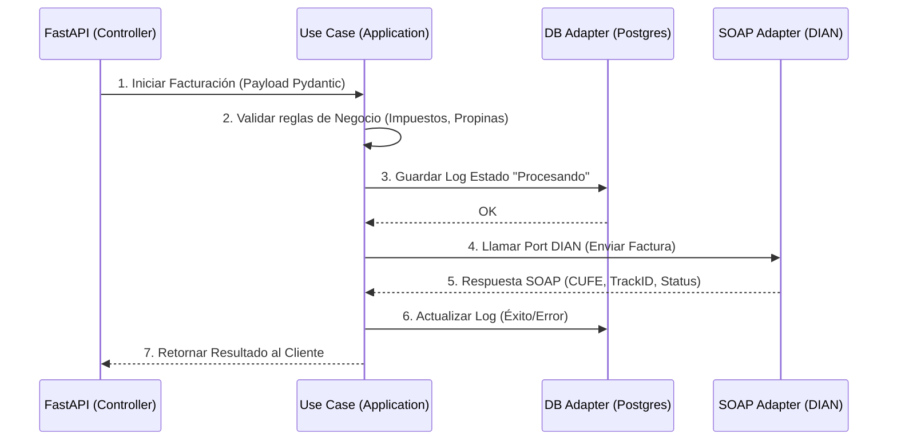

This page traces a single electronic invoice request from the exact moment it enters the FastAPI controller — as raw JSON bytes on a TCP socket — to the moment a DIAN track ID and CUFE are serialised back to the caller. Every layer crossing is explicit: HTTP deserialization, dependency injection, business validation, domain mapping, PostgreSQL audit logging, async SOAP dispatch, and HTTP response. Understanding this flow is essential for debugging, for extending the system with new document types, and for reasoning about where failures originate.

## The 7-Step Flow

<Steps>
  <Step title="HTTP Request">
    The client sends `POST /api/v1/pedidos/consumo-local/` with a JSON body describing the restaurant order. FastAPI reads the request body and deserialises it into a `PedidoLocalCreateRequest` Pydantic model, running full field-type coercion and constraint validation (e.g. `items` must have at least one element, `cantidad` must be `> 0`). Any schema violation is rejected immediately with HTTP `422 Unprocessable Entity` before the route handler is ever invoked.

    ```json
    {
      "id_pedido_origen": "POS-100",
      "items": [
        {
          "id_producto": "B-01",
          "descripcion": "Cerveza Artesanal",
          "cantidad": 2,
          "precio_unitario": "10000.00",
          "impuestos": [
            { "nombre": "INC", "tasa": "0.08", "monto": "1600.00" }
          ],
          "total_item": "21600.00"
        }
      ],
      "subtotal": "20000.00",
      "propina_voluntaria": "3000.00",
      "impuestos_totales": "1600.00",
      "total_factura": "24600.00",
      "metodos_pago": [{ "tipo": "Efectivo", "monto": "24600.00" }]
    }
    ```
  </Step>

  <Step title="Dependency Injection">
    FastAPI evaluates the `Depends()` graph declared on the route handler before calling it. First, `get_dian_adapter()` is called: it reads `settings.ENVIRONMENT` to select the correct WSDL URL (habilitación vs. producción), then constructs a `DianSoapAdapter` with the WSDL URL, PFX certificate path, and certificate password. Second, `get_use_case()` receives the adapter via `Depends(get_dian_adapter)` and constructs `FacturarPedidoLocalUseCase`, injecting the adapter as the `dian_port` argument.

    ```python
    def get_dian_adapter() -> DianSoapAdapter:
        wsdl = (
            settings.DIAN_WSDL_URL_HABILITACION
            if settings.ENVIRONMENT != 'production'
            else settings.DIAN_WSDL_URL_PRODUCCION
        )
        return DianSoapAdapter(
            wsdl_url=wsdl,
            cert_path=str(settings.DIAN_CERT_PATH),
            password=settings.DIAN_CERT_PASSWORD.get_secret_value()
        )

    def get_use_case(
        dian_adapter: DianSoapAdapter = Depends(get_dian_adapter)
    ) -> FacturarPedidoLocalUseCase:
        ...
        return FacturarPedidoLocalUseCase(
            dian_port=dian_adapter,
            log_repo=MockLogRepo()  # ⚠ Bug: should be log_repository=MockLogRepo()
        )
    ```

    <Warning>
    The current source passes `log_repo=MockLogRepo()` to the use case constructor, but `FacturarPedidoLocalUseCase.__init__` declares the parameter as `log_repository`. This keyword argument name mismatch will raise a `TypeError` at runtime. It must be corrected to `log_repository=MockLogRepo()` before the dependency injection chain is exercised in production.
    </Warning>
  </Step>

  <Step title="Business Validation">
    `FacturarPedidoLocalUseCase.execute()` performs domain-level validation that cannot be expressed as a Pydantic field constraint: it checks that `total_factura` equals the arithmetic sum of `subtotal + impuestos_totales + propina_voluntaria`. The voluntary tip (`propina_voluntaria`) is included in the invoice total but is **not** part of the taxable base — a Colombian DIAN fiscal rule — so the validation confirms the totals are self-consistent before any external call is attempted.

    ```python
    expected_total = payload.subtotal + payload.impuestos_totales + payload.propina_voluntaria
    if payload.total_factura != expected_total:
        raise ValueError(
            "El total de la factura no coincide con la suma del subtotal, impuestos y propina."
        )
    ```

    A `ValueError` here returns HTTP `500` to the caller and no log entry is written, since the request was malformed at the business level.
  </Step>

  <Step title="Domain Mapping">
    The validated Pydantic DTO (`PedidoLocalCreateRequest`) is mapped field-by-field into pure domain entities. Each `ItemPedidoRequest` becomes an `ItemPedido` with its nested list of `ConceptoImpuesto`. Each `PagoRequest` becomes a `MetodoPago`. The optional `AdquirenteRequest` becomes an `Adquirente`; if omitted, an `Adquirente()` is constructed using Colombian fiscal defaults (`tipo_documento="13"`, `numero_documento="222222222222"`, `razon_social="Consumidor Final"`). All assembled into a `PedidoLocal` domain entity.

    This mapping step is the architectural boundary: from here forward, only domain types travel through the application core. Infrastructure types (`PedidoLocalCreateRequest`, Pydantic HTTP schemas) do not cross into the DIAN port call.
  </Step>

  <Step title="Log Attempt (PROCESANDO)">
    Before any outbound network call is made, the use case persists the attempt to the audit log via `IInvoiceLogRepositoryPort.save_log()`:

    ```python
    await self.log_repository.save_log(
        status="PROCESANDO",
        payload_in=payload.model_dump()
    )
    ```

    This guarantees that even if the DIAN SOAP call never returns (network timeout, process crash), a `PROCESANDO` record exists in PostgreSQL with the full inbound payload. Operations teams can query for stale `PROCESANDO` entries to identify stuck invoices.
  </Step>

  <Step title="DIAN SOAP Call">
    `IDianSoapPort.send_invoice(invoice_data)` is awaited. The concrete `DianSoapAdapter` uses a `zeep.AsyncClient` backed by an `httpx.AsyncClient` with a 30-second timeout to call `service.SendTestSetAsync(fileName, contentFile, testSetId)` against the DIAN WSDL:

    ```python
    response = await self.client.service.SendTestSetAsync(
        fileName=invoice_data.get("filename", "factura.xml"),
        contentFile=invoice_data.get("xml_base64", ""),
        testSetId=invoice_data.get("test_set_id", "")
    )
    ```

    The adapter normalises the raw zeep response into a plain dict before returning it to the use case. Error handling inside the adapter is described in the [Error Handling](#error-handling) section below.
  </Step>

  <Step title="Response and Log Update">
    On success, the use case extracts `track_id`, `cufe`, and `status` from the DIAN response dict, updates the audit log with `status="SUCCESS"` and the full response payload, then returns a `PedidoLocalResponse`:

    ```python
    await self.log_repository.save_log(
        status=status,
        payload_in=payload.model_dump(),
        response_out=dian_res
    )
    return PedidoLocalResponse(
        track_id=track_id,
        cufe=cufe,
        status=status,
        message="Factura procesada con éxito."
    )
    ```

    On failure, the exception is caught, the log is updated with `status="FAILED"` and the error string, and the exception is re-raised so the controller can return HTTP `500`:

    ```python
    except Exception as e:
        await self.log_repository.save_log(
            status="FAILED",
            payload_in=payload.model_dump(),
            response_out={"error": str(e)}
        )
        raise e
    ```
  </Step>
</Steps>

## WSDL Environment Selection

The adapter is configured with the correct DIAN WSDL endpoint at dependency injection time. `settings.ENVIRONMENT` drives the selection — any value other than `"production"` routes to the DIAN habilitación (testing) environment:

```python
def get_dian_adapter() -> DianSoapAdapter:
    """Provee la instancia configurada del Adaptador SOAP de la DIAN."""
    # En producción se decidiría entre WSDL de Habilitación o Producción
    # según un flag de entorno (ej. settings.ENVIRONMENT == 'production')
    wsdl = (
        settings.DIAN_WSDL_URL_HABILITACION
        if settings.ENVIRONMENT != 'production'
        else settings.DIAN_WSDL_URL_PRODUCCION
    )
    return DianSoapAdapter(
        wsdl_url=wsdl,
        cert_path=str(settings.DIAN_CERT_PATH),
        password=settings.DIAN_CERT_PASSWORD.get_secret_value()
    )
```

Both WSDL URLs (`DIAN_WSDL_URL_HABILITACION` and `DIAN_WSDL_URL_PRODUCCION`) are required fields in `Settings` — the application fails at startup if either is missing from the environment, preventing a misconfigured container from ever serving traffic.

<Warning>
Never set `ENVIRONMENT=production` in a development or CI environment. The application will route all SOAP calls to the live DIAN production service, which generates real legal fiscal documents.
</Warning>

## Error Handling

`DianSoapAdapter.send_invoice()` catches all exceptions internally and converts them to a normalised error dict rather than propagating zeep or httpx exceptions up through the application layer:

```python
except httpx.TimeoutException:
    return {
        "success": False,
        "error": "Timeout",
        "message": "La DIAN tardó demasiado en responder."
    }
except Exception as e:
    return {
        "success": False,
        "error": type(e).__name__,
        "message": str(e)
    }
```

| Condition | `error` value | Meaning |
|---|---|---|
| DIAN did not respond within 30 s | `"Timeout"` | `httpx.TimeoutException` from the async transport |
| Any other exception | `type(e).__name__` | WSDL parse error, connection refused, XML fault, etc. |

The controller checks `result.get("success")` on the returned `PedidoLocalResponse`. If `False`, it returns `HTTP 500` with the error detail:

```python
result = await use_case.execute(payload)

if not result.get("success"):
    return JSONResponse(
        status_code=status.HTTP_500_INTERNAL_SERVER_ERROR,
        content={"message": "Error enviando a la DIAN", "details": result}
    )
```

<Tip>
Because the adapter normalises all errors into a dict before returning, the use case and controller never need to import `httpx` or `zeep` — infrastructure exception types remain fully contained inside the adapter.
</Tip>

## Sequence Diagram

The complete flow visualised as a Mermaid sequence diagram, reproduced verbatim from the architecture specification:



For a deeper explanation of the port/adapter contracts that each arrow in this diagram crosses, see the [Hexagonal Design](/architecture/hexagonal) page. For the system-wide technology choices that underpin this flow, see the [Architecture Overview](/architecture/overview) page.
